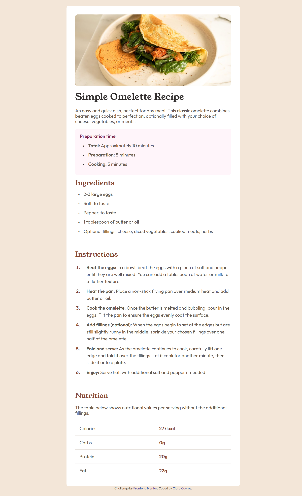
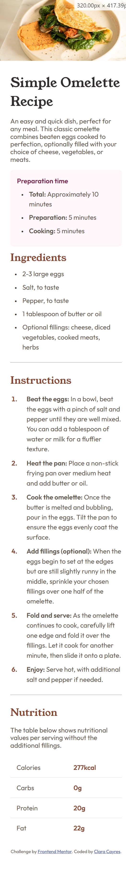

# Frontend Mentor - Recipe Page

This project is a solution for the [Frontend Mentor](https://www.frontendmentor.io/challenges/recipe-page-KiTsR8QQKm) challenge.

## 🖼️ Screenshot

### Desktop

### Mobile

## 🔗 Links

- Repository: [GitHub](https://github.com/claracayres/recipe-page-main)
- Live Site: [Live Site](https://claracayres.github.io/recipe-page-main)

## 🏁 The Challenge

The challenge was to build a static recipe page based on a design provided by Frontend Mentor. The goal was to replicate the layout as closely as possible using only HTML and CSS.

**Requirements:**

- Recreate the layout with clean and semantic HTML
- Style the page using only CSS (no frameworks)
- Ensure responsiveness across different screen sizes
- Pay attention to spacing, typography, and visual hierarchy
- Match the design’s accessibility and visual feel

## ⚙️ Built With

- HTML5
- CSS3
- Mobile First
- Flexbox
- CSS Variables

## 💡 What I Learned

- How to align neat bullets with wrapped text
- How to work with `line-height` and `::before` to style lists
- Improved my skills with spacing and responsiveness
- How to use tables

## 👩‍💻 Author

- GitHub: [@claracayres](https://github.com/claracayres)
- Frontend Mentor: [@claracayres](https://www.frontendmentor.io/profile/claracayres)
